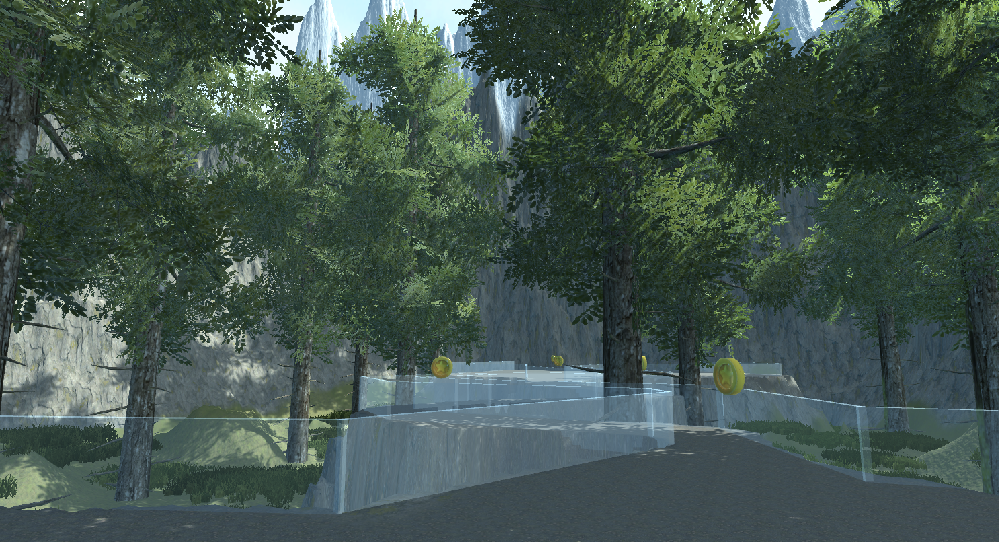
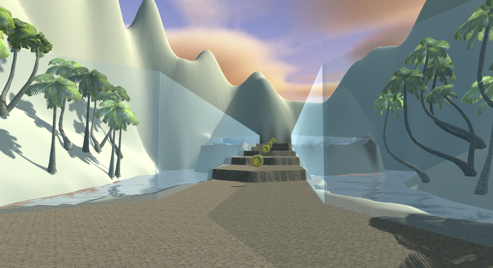
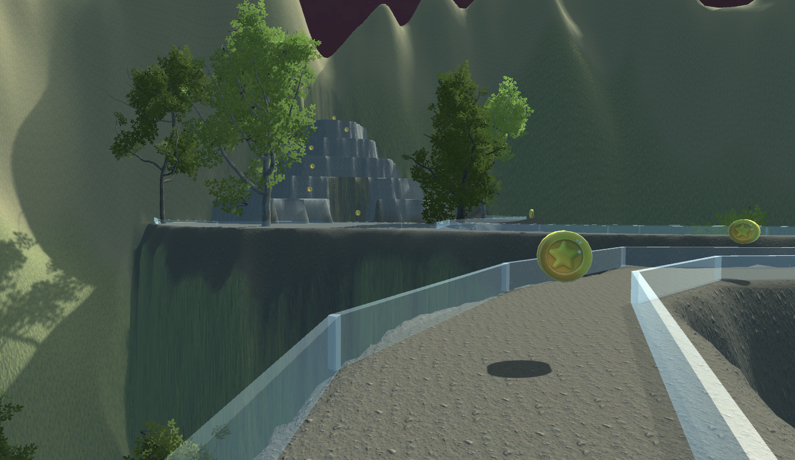
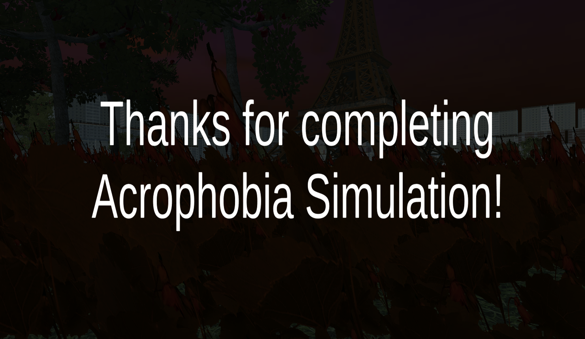

# Acrophobia Simulation

## Overview

**Acrophobia Simulation** is a Virtual Reality (VR) project designed to help individuals experiencing acrophobia (fear of heights). This simulation provides users with a safe environment to face their phobia and gradually become more comfortable with heights through gamification. Users collect coins to progress through different levels, which helps them adapt to the situations they are placed in.

## Features

- **Immersive VR Experience**: Provides a realistic environment that simulates various heights.
- **Gamification**: Collect coins to progress through levels, encouraging user engagement and adaptation.
- **Multiple Levels**: Experience different intensities of height to gradually overcome acrophobia.
- **User-Friendly Interface**: Easy-to-navigate VR environment for users of all ages.

## Screenshots

## License

This project is licensed under the MIT License - see the [LICENSE](LICENSE) file for details.

